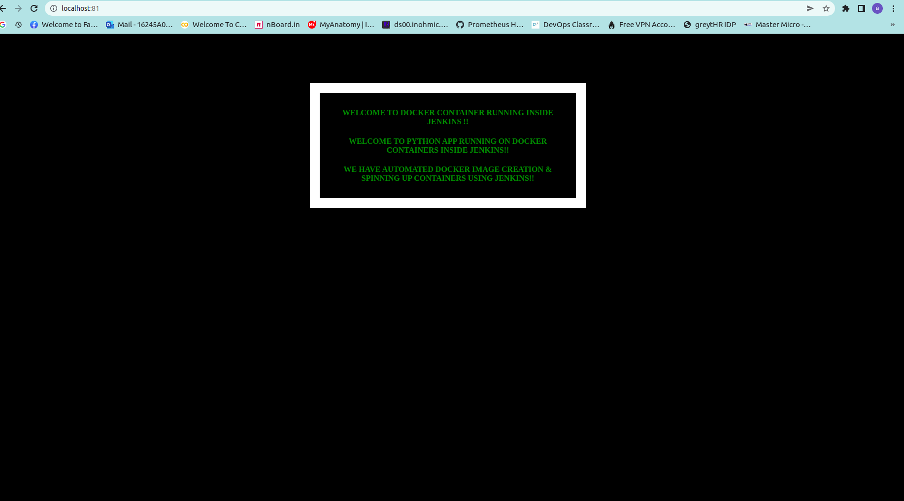

README

This README documents the steps to ansible appication deployment the  python appication

first install the ansible

from ref:

https://www.digitalocean.com/community/tutorials/how-to-install-and-configure-ansible-on-ubuntu-18-04

Requirements

The below requirements are needed on the host that executes this module.

   python >= 2.7

   openshift >= 0.6

   PyYAML >= 3.11

create a folder

   mkdir folder name
copy from ansible

   cp -rpP /etc/ansible/* .
By using ansible role

mkdir role folder
   cd folder name

   ansible-galaxy init anyname --offline

To run ansible playbook

   ansible-playbook filename

   eg: ansible-playbook pythonrun.yaml

To see the appication 

